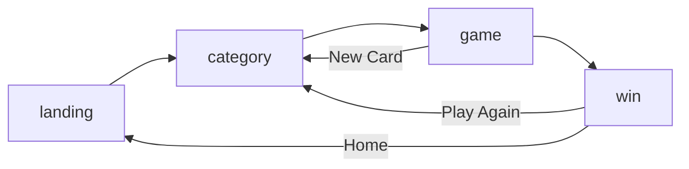

# Meeting Bingo — Implementation Plan

**Synthesized from**: PRD v1.0, Architecture v1.0, UXR v1.0
**Build Target**: 90-minute MVP
**Stack**: React 18 + TypeScript · Vite · Tailwind CSS · Web Speech API · Vercel

---

## Overview

Four sequential phases timed for the 90-minute workshop constraint. Each phase is independently shippable — if time runs short, stop at the end of any phase and you have a working product.

| Phase | Focus | Time | Deliverable |
|-------|-------|------|-------------|
| 1 | Project Foundation | 20 min | Scaffolding, types, data |
| 2 | Core Game | 30 min | Playable card with manual tap + BINGO detection |
| 3 | Speech Integration | 25 min | Auto-fill via Web Speech API |
| 4 | Polish & Deploy | 15 min | Confetti, share, Vercel deploy |

---

## Phase 1 — Project Foundation (20 min)

### 1.1 Scaffold the Project

```bash
npm create vite@latest meeting-bingo -- --template react-ts
cd meeting-bingo
npm install canvas-confetti
npm install -D tailwindcss postcss autoprefixer
npx tailwindcss init -p
```

### 1.2 Configure Tailwind

In `tailwind.config.js`, set content paths:
```js
content: ["./index.html", "./src/**/*.{js,ts,jsx,tsx}"]
```

Add to `src/index.css`:
```css
@tailwind base;
@tailwind components;
@tailwind utilities;
```

### 1.3 Create Project Structure

```
src/
├── main.tsx
├── App.tsx
├── index.css
├── components/
│   ├── LandingPage.tsx
│   ├── CategorySelect.tsx
│   ├── GameBoard.tsx
│   ├── BingoCard.tsx
│   ├── BingoSquare.tsx
│   ├── TranscriptPanel.tsx
│   ├── WinScreen.tsx
│   ├── GameControls.tsx
│   └── ui/
│       ├── Button.tsx
│       ├── Card.tsx
│       └── Toast.tsx
├── hooks/
│   ├── useSpeechRecognition.ts
│   ├── useGame.ts
│   ├── useBingoDetection.ts
│   └── useLocalStorage.ts
├── lib/
│   ├── cardGenerator.ts
│   ├── wordDetector.ts
│   ├── bingoChecker.ts
│   └── shareUtils.ts
├── data/
│   └── categories.ts
├── types/
│   └── index.ts
└── context/
    └── GameContext.tsx
```

### 1.4 Define Types (`src/types/index.ts`)

Key interfaces to define:
- `CategoryId` — `'agile' | 'corporate' | 'tech'`
- `BingoSquare` — `id`, `word`, `isFilled`, `isAutoFilled`, `isFreeSpace`, `filledAt`, `row`, `col`
- `BingoCard` — `squares: BingoSquare[][]`, `words: string[]`
- `GameStatus` — `'idle' | 'setup' | 'playing' | 'won'`
- `WinningLine` — `type`, `index`, `squares: string[]`
- `GameState` — full game state including card, status, listening state, timestamps
- `SpeechRecognitionState` — `isSupported`, `isListening`, `transcript`, `interimTranscript`, `error`

### 1.5 Add Buzzword Data (`src/data/categories.ts`)

Three categories, 40+ words each:

| Category | Icon | Sample Words |
|----------|------|-------------|
| `agile` | 🏃 | sprint, backlog, velocity, blocker, story points, retrospective, CI/CD… |
| `corporate` | 💼 | synergy, leverage, circle back, low-hanging fruit, paradigm shift, ROI… |
| `tech` | 💻 | API, microservices, kubernetes, observability, postmortem, feature flag… |

**Acceptance criteria**: Each category has ≥ 40 words. No duplicates within a category.

---

## Phase 2 — Core Game (30 min)

### 2.1 Card Generator (`src/lib/cardGenerator.ts`)

Algorithm:
1. Look up the selected category's word list
2. Fisher-Yates shuffle the full word list
3. Slice first 24 shuffled words
4. Build 5×5 grid — center cell `[2][2]` is always `FREE`
5. Pre-set `isFilled: true` and `isFreeSpace: true` on the free space

**Acceptance criteria**:
- 24 unique words per card (no duplicates)
- Free space always center
- Card renders in < 2 seconds

### 2.2 BINGO Checker (`src/lib/bingoChecker.ts`)

Check all 12 possible winning lines on every state change:
- 5 rows
- 5 columns
- 2 diagonals (↘ and ↙)

Return the first `WinningLine` found, or `null`. Also expose:
- `countFilled(card)` — for progress counter
- `getClosestToWin(card)` — for "one away!" hint UI

**Acceptance criteria**: All 12 lines detected correctly. Free space counts toward all lines it belongs to.

### 2.3 Screen Components

#### Landing Page (`LandingPage.tsx`)
- App name + tagline
- "New Game" CTA (prominent)
- Privacy message: *"Audio processed locally. Never recorded."*
- "How it works" steps (pick category → enable mic → watch squares fill)

#### Category Select (`CategorySelect.tsx`)
- 3 cards: Agile, Corporate, Tech
- Show icon + name + 3–4 sample words per card
- "Back" button
- Clicking a card immediately generates a new bingo card and advances to game

#### Bingo Card (`BingoCard.tsx` + `BingoSquare.tsx`)
- 5×5 responsive grid
- Tap to toggle filled state (manual fallback — always available)
- Square states and colors:

| State | Style |
|-------|-------|
| Default | White bg, gray border |
| Filled (manual) | Blue bg, white text, strikethrough |
| Filled (auto) | Blue bg + pulse animation |
| Free space | Amber bg, star icon, non-interactive |
| Winning square | Green bg, ring highlight |

#### Game Header (`GameBoard.tsx`)
- Logo / title
- Listening status indicator (red pulsing dot when active)
- Progress counter: `X/24 squares filled`

#### Game Controls (`GameControls.tsx`)
- Toggle listening button
- New card button (resets game state)

### 2.4 App Routing (`App.tsx`)

Four screens managed with `useState<Screen>`:



**Acceptance criteria**: Navigation works in all directions. Game state is reset properly on "New Card" and "Home".

---

## Phase 3 — Speech Integration (25 min)

### 3.1 Speech Recognition Hook (`src/hooks/useSpeechRecognition.ts`)

Wrap the browser Web Speech API:

```
SpeechRecognition config:
  continuous: true       ← don't stop after silence
  interimResults: true   ← show partial results live
  lang: 'en-US'
```

Key behaviors:
- Auto-restart on `onend` if still in listening state (handles browser timeouts)
- Expose `startListening(onResult)`, `stopListening()`, `resetTranscript()`
- Graceful no-op if `SpeechRecognition` unavailable — game stays fully playable via manual tap

**Acceptance criteria**:
- Transcription starts within 1 second of enabling
- Continuous — does not stop after silence
- `isSupported: false` triggers visible fallback message, not a crash

### 3.2 Word Detector (`src/lib/wordDetector.ts`)

Two-pass detection:

**Pass 1 — Direct match**:
- Normalize both transcript and card word to lowercase
- Single words: word-boundary regex `\b{word}\b`
- Multi-word phrases: substring match

**Pass 2 — Alias match**:
- Predefined alias map for abbreviations/variants:
  - `ci/cd` → `cicd`, `continuous integration`
  - `roi` → `return on investment`
  - `api` → `a.p.i.`
  - `devops` → `dev ops`, `dev-ops`
  - `mvp` → `minimum viable product`

Skip words already in `alreadyFilled` set on every call.

**Acceptance criteria**:
- > 70% detection accuracy in manual testing
- Same word spoken twice only fills square once
- Compound words (`code review`, `story points`) detected correctly

### 3.3 Auto-Fill Wire-Up

In the `useGame` hook, on each new final transcript chunk:
1. Call `detectWordsWithAliases(chunk, cardWords, filledSet)`
2. For each detected word, find its square(s) on the card
3. Set `isFilled: true`, `isAutoFilled: true`, `filledAt: Date.now()`
4. Run bingo check — if win, transition to `won` status
5. Show toast notification for each detected word

**Acceptance criteria**:
- Auto-fill animation appears within 500ms of word being spoken
- Toast shows detected word name
- Win screen triggers immediately on qualifying fill

### 3.4 Transcript Panel (`TranscriptPanel.tsx`)

- Pulsing red dot + "Listening…" / "Paused" label
- Last ~100 characters of confirmed transcript (gray)
- Current interim transcript (italic, lighter)
- Detected words chip list (last 5, green pills with ✨)

**UXR note**: This panel is the "trust signal" — it proves the transcription is working. The first auto-fill is the product's magic moment; the panel primes users to trust it.

---

## Phase 4 — Polish & Deploy (15 min)

### 4.1 Win Celebration (`WinScreen.tsx`)

- `canvas-confetti` burst on mount
- "BINGO!" heading, prominent
- Winning card displayed with winning line highlighted in green
- Stats:
  - ⏱ Time to BINGO
  - 🏆 Winning word
  - 📊 Squares filled (X/24)
  - Category played
- No sound by default (user is still in a meeting)

**UXR note**: Celebration must be satisfying but discreet. Confetti = visual delight without noise.

### 4.2 Share Functionality (`src/lib/shareUtils.ts`)

Share text format:
```
🎯 I got Meeting Bingo!
Category: Agile & Scrum
Time: 18 minutes
Winning word: "Scope Creep"
12/24 squares filled

Play at: meetingbingo.vercel.app
```

- Desktop: copy to clipboard → show "Copied!" toast
- Mobile: trigger native `navigator.share()` if available

**Acceptance criteria**: Pasting into Slack/Teams/Discord works. Includes game link.

### 4.3 localStorage Persistence (`src/hooks/useLocalStorage.ts`)

Persist `GameState` to `localStorage` on every state change. On app load, restore last game if status is `'playing'`. Clear on "New Game".

**Acceptance criteria**: Refreshing the page during a game restores the card and filled squares.

### 4.4 Deploy to Vercel

```bash
# Build
npm run build

# Deploy (one-time setup)
npx vercel --prod
```

Or connect GitHub repo to Vercel for automatic deploys on push to `main`.

---

## Key Moments Checklist (from UXR)

These four moments define the product experience. Verify each before shipping:

| Moment | Trigger | Required Feeling | Design Check |
|--------|---------|-----------------|--------------|
| **First auto-fill** | First buzzword detected | "It actually works!" — delight + trust | Animation visible, toast shows word, < 500ms |
| **Near-bingo tension** | 4-in-a-row reached | Anticipation, active listening | "One away!" indicator, potential word(s) shown |
| **BINGO!** | 5th square in line filled | Peak joy, pride, desire to share | Confetti plays, winning line highlighted, share button prominent |
| **Share** | Share button tapped | Social connection, viral loop | Correct text copied, game link included |

---

## Testing Checklist

### Pre-Speech (Phase 2 complete)
- [ ] Card generates with exactly 24 unique words + free space
- [ ] Free space is center, pre-filled
- [ ] Manual tap toggles square on/off
- [ ] BINGO detected for all 12 lines (5 rows, 5 cols, 2 diagonals)
- [ ] Win screen shows correct stats
- [ ] Navigation works in all directions

### Speech (Phase 3 complete)
- [ ] Microphone permission prompt appears with privacy message
- [ ] Transcription starts within 1 second
- [ ] Transcript panel shows live text
- [ ] Buzzwords auto-fill squares
- [ ] Same word spoken twice only fills once
- [ ] Compound words detected (`story points`, `code review`)
- [ ] Graceful fallback if mic denied (manual mode only, no crash)

### Edge Cases
- [ ] Multiple words detected in same sentence
- [ ] Browser tab switch and return — transcription resumes
- [ ] Page refresh during game — state restored
- [ ] Mobile layout correct (portrait and landscape)

---

## Risk Mitigations

| Risk | Mitigation |
|------|------------|
| Web Speech API unavailable (Firefox, older Safari) | Feature-detect on load; show "Manual mode" banner; all manual tap features still work |
| Poor transcription accuracy | Word aliases for common variants; manual tap always available |
| Workshop time overrun | Phases are independently shippable; skip Phase 4 if needed — Phase 2 result is fully playable |
| Microphone permission denied | Show clear instructions; game continues in manual-only mode |

---

## Post-MVP Backlog (do not build in workshop)

| Feature | Value | Effort |
|---------|-------|--------|
| Custom buzzword lists | High | Low |
| Multiplayer real-time sync | High | High |
| PWA / installable app | Medium | Medium |
| Achievement system | Medium | Medium |
| Dark mode | Low | Low |
| Sound effects toggle | Low | Low |
